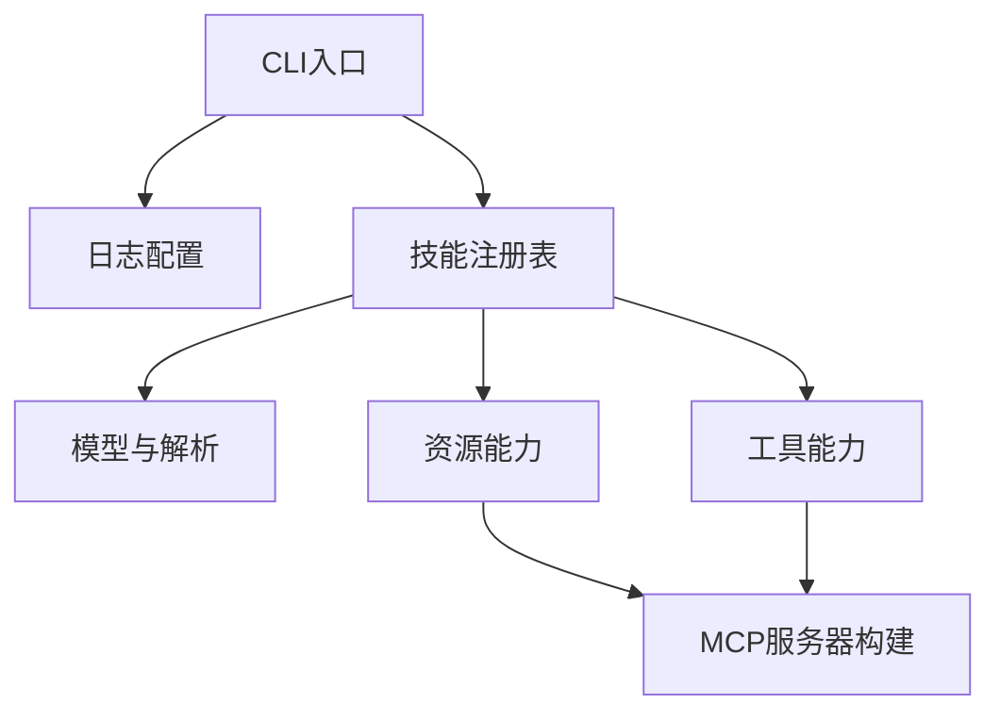

作者:Codex|创建时间:2026-01-18 10:54

# 目标
- 将 `src/skillz/_server.py` 拆分为多个职责清晰的模块，降低单文件体积与复杂度
- 保持现有对外 API 与行为一致，避免破坏现有测试与调用方
- 明确模块边界，减少循环依赖风险

# 现状概览
- `_server.py` 同时承担：模型定义、技能解析、注册表、资源读取、工具注册、日志配置、服务器构建与 CLI
- 文件长度超过 1200 行，后续维护与定位成本高

# 拆分方案
## 模块职责划分
- `src/skillz/_skill_models.py`
  - 常量与异常：`SKILL_MARKDOWN`、`FRONT_MATTER_PATTERN`、`SkillError`、`SkillValidationError`
  - 数据结构：`SkillMetadata`、`Skill`、`SkillResourceMetadata`
  - 解析与工具：`slugify`、`parse_skill_md`
- `src/skillz/_skill_registry.py`
  - `SkillRegistry` 及目录与 zip 扫描、资源收集逻辑
- `src/skillz/_skill_resources.py`
  - 资源 URI 生成与 MIME 识别
  - `register_skill_resources`、`_fetch_resource_json` 等资源读取逻辑
- `src/skillz/_skill_tools.py`
  - 工具描述生成与 `register_skill_tool`
- `src/skillz/_logging.py`
  - `configure_logging`
- `src/skillz/_server.py`
  - 仅保留服务器构建与 CLI 入口
  - `build_server`、`list_skills`、`parse_args`、`main`
  - 对外再导出旧名称以保持兼容

## 依赖关系

## 关键行为保持
- 资源 URI 与 MIME 识别策略不变
- zip 技能与目录技能的解析逻辑保持一致
- 现有 `skillz.__init__` 与 `skillz.__main__` 导出保持可用

# 需求清单
- [ ] 拆分模块并调整导入路径
- [ ] 保持 `_server.py` 对外接口不变
- [ ] 更新 `__init__.py` 的导出来源
- [ ] 运行现有测试确保行为一致

# 待确认事项
- [ ] 是否接受新增模块文件名采用 `_skill_models.py` 等命名 (需用户确认)
- [ ] 是否需要将 `build_server` 继续保留在 `_server.py` 作为唯一入口 (需用户确认)

# 实施步骤
1. 创建新模块文件并迁移对应代码
2. 处理导入关系，避免循环依赖
3. 精简 `_server.py` 为入口与编排层
4. 更新 `__init__.py` 与 `__main__.py` 引用
5. 运行测试并修复潜在导入问题

# 风险与应对
- 可能出现循环依赖：通过调整模型与解析归属、减少互相引用来规避
- 导入路径变更导致测试失败：保持 `_server.py` 再导出旧名称
